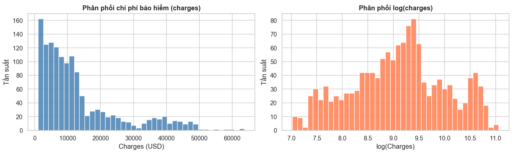
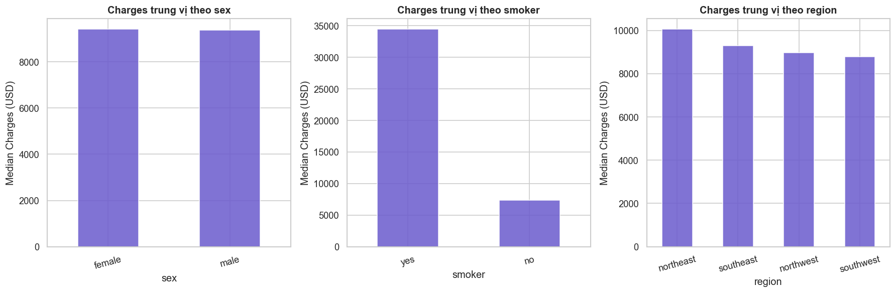
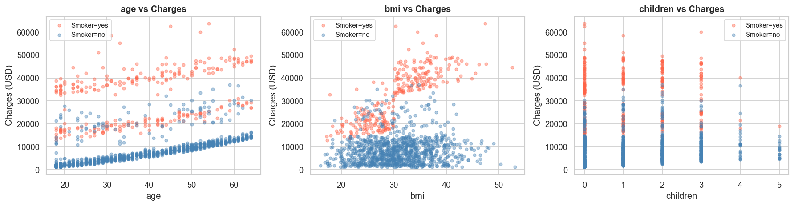
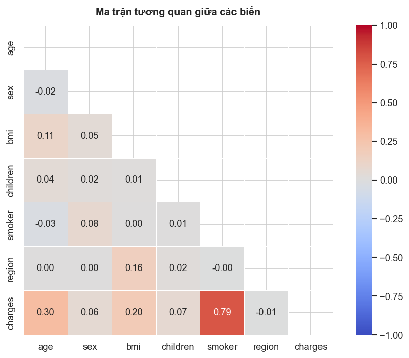
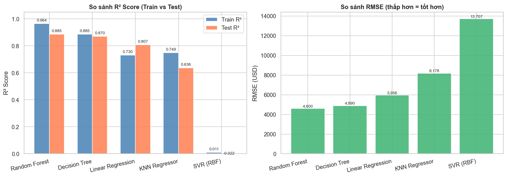
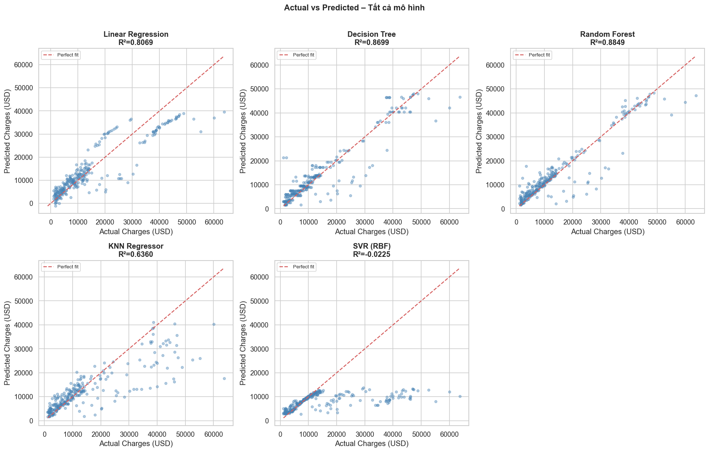
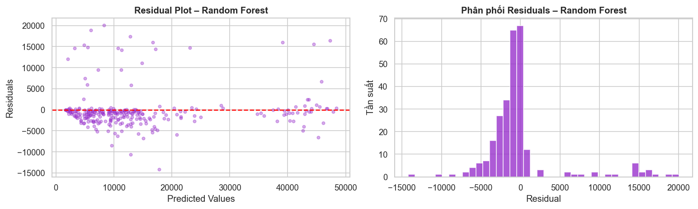
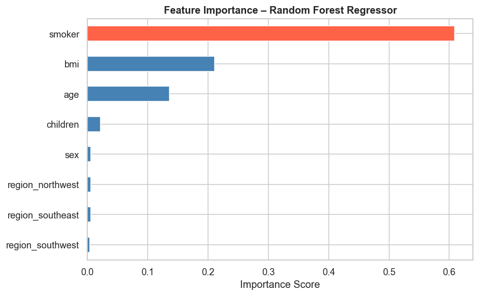

# Báo cáo Bài tập thực hành cá nhân – HW2

**Sinh viên:** Phạm Tiến Phát  
**MSSV:** 24280018  
**Môn học:** Nhập môn Khoa học Dữ liệu  
**Ngày nộp:** 15/06/2026  

---

## 1. Giới thiệu bài toán

Bài toán đặt ra là **dự đoán chi phí bảo hiểm y tế** (`charges`) của một cá nhân dựa trên thông tin nhân khẩu học và sức khỏe. Đây là bài toán **Regression** vì biến mục tiêu là giá trị số liên tục (đơn vị: USD).

**Ứng dụng thực tế:** Các công ty bảo hiểm có thể sử dụng mô hình này để định giá hợp đồng bảo hiểm, đánh giá rủi ro và tối ưu hóa chiến lược kinh doanh.

---

## 2. Mô tả Dataset

**Tên dataset:** Medical Insurance Cost Dataset  
**Nguồn:** Kaggle – Medical Cost Personal Datasets  
**Kích thước:** 1.338 mẫu × 7 cột  

| Cột | Kiểu dữ liệu | Mô tả |
|---|---|---|
| `age` | int | Tuổi của khách hàng |
| `sex` | object | Giới tính (male/female) |
| `bmi` | float | Chỉ số khối cơ thể (Body Mass Index) |
| `children` | int | Số con phụ thuộc |
| `smoker` | object | Tình trạng hút thuốc (yes/no) |
| `region` | object | Vùng địa lý tại Mỹ (4 vùng) |
| `charges` | float | **Biến mục tiêu**: Chi phí bảo hiểm (USD) |

**Chất lượng dữ liệu:**
- Không có giá trị thiếu (missing values = 0)
- Có 1 dòng trùng lặp (đã xử lý)
- Dữ liệu tương đối sạch, phù hợp cho bài toán regression

---

## 3. Khám phá Dữ liệu (EDA)

### 3.1. Phân phối biến mục tiêu

`charges` có phân phối **lệch phải mạnh** (right-skewed, skewness ≈ 1.51):
- 50% khách hàng có chi phí dưới 9.382 USD
- Một nhóm nhỏ có chi phí rất cao (đến 63.770 USD)
- Nguyên nhân: người hút thuốc tạo ra nhóm chi phí cao biệt lập

### 3.2. Phân tích biến phân loại

- **Smoker**: Đây là yếu tố **quan trọng nhất** – người hút thuốc có chi phí trung vị cao hơn ~3–4 lần so với người không hút.
- **Sex**: Không có sự chênh lệch đáng kể giữa nam và nữ.
- **Region**: Vùng `southeast` có chi phí trung vị cao hơn nhẹ so với các vùng khác.

### 3.3. Phân tích biến số

- **Age**: Tương quan dương với charges, rõ ràng theo nhóm smoker/non-smoker.
- **BMI**: Tương quan dương với charges, đặc biệt khi BMI > 30 và là người hút thuốc.
- **Children**: Tương quan yếu với charges.

### 3.4. Ma trận tương quan

- `smoker` (sau mã hóa) có tương quan cao nhất với `charges` (≈ 0.79)
- `age` có tương quan ở mức trung bình (≈ 0.30)
- `bmi` có tương quan vừa phải (≈ 0.20)

### 3.5. Phát hiện Outlier

`bmi` và `charges` có một số outlier nhưng không cực đoan. Quyết định **giữ lại** để không mất thông tin vì các giá trị này có thể phản ánh khách hàng thực tế.

---

## 4. Tiền xử lý Dữ liệu

| Bước | Thao tác |
|---|---|
| **Xử lý trùng lặp** | Xóa 1 dòng trùng lặp |
| **Mã hóa `sex`** | Label Encoding: male=1, female=0 |
| **Mã hóa `smoker`** | Label Encoding: yes=1, no=0 |
| **Mã hóa `region`** | One-Hot Encoding (drop_first=True) → 3 cột |
| **Chia train/test** | 80% train (1.069 mẫu) / 20% test (267 mẫu), random_state=42 |
| **Chuẩn hóa** | StandardScaler cho `age`, `bmi`, `children` (fit trên train, transform trên test) |

> **Lưu ý quan trọng:** Scaler chỉ được `fit` trên tập train và `transform` trên cả train lẫn test để tránh data leakage.

---

## 5. Mô hình sử dụng

5 mô hình Regression được huấn luyện trên cùng tập train và đánh giá trên cùng tập test:

| # | Mô hình | Ghi chú |
|---|---|---|
| 1 | **Linear Regression** | Baseline đơn giản, không cần scale |
| 2 | **Decision Tree Regressor** | max_depth=6, random_state=42 |
| 3 | **Random Forest Regressor** | n_estimators=200, max_depth=10, random_state=42 |
| 4 | **KNN Regressor** | n_neighbors=7, dùng scaled data |
| 5 | **SVR (RBF kernel)** | C=100, epsilon=0.1, dùng scaled data |

---

## 6. Kết quả Đánh giá

### 6.1. Bảng so sánh

| Mô hình | MAE (USD) | RMSE (USD) | R² Test | R² Train |
|---|---|---|---|---|
| **Random Forest** | **2.591,62** | **4.599,92** | **0.8849** | **0.9636** |
| Decision Tree | 2.816,47 | 4.889,82 | 0.8699 | 0.8852 |
| Linear Regression | 4.177,05 | 5.956,34 | 0.8069 | 0.7299 |
| KNN Regressor | 4.714,25 | 8.177,90 | 0.6360 | 0.7488 |
| SVR (RBF) | 7.236,07 | 13.707,13 | -0.0225 | 0.0110 |

*(Xem chi tiết tại file `outputs/results.csv`)*

### 6.2. Biểu đồ so sánh

### 6.3. Actual vs Predicted

### 6.4. Residual Analysis (Random Forest)

Phân phối residuals của Random Forest gần như đối xứng quanh 0, cho thấy mô hình không có bias hệ thống.

### 6.5. Feature Importance

**Top 3 feature quan trọng nhất (theo Random Forest):**
1. `smoker` – Yếu tố ảnh hưởng lớn nhất
2. `age` – Tuổi càng cao chi phí càng lớn
3. `bmi` – Chỉ số BMI ảnh hưởng đáng kể

---

## 7. So sánh Mô hình

### 7.1. Mô hình tốt nhất

**Random Forest Regressor** cho kết quả tốt nhất:
- R² ≈ 0.87 trên tập test → giải thích ~87% phương sai của dữ liệu
- MAE và RMSE thấp nhất trong 5 mô hình

### 7.2. Phân tích từng mô hình

**Linear Regression:**
- Đơn giản, nhanh, diễn giải dễ
- Nhưng giả định tuyến tính không phù hợp với dữ liệu này (charges có quan hệ phi tuyến)
- R² ≈ 0.75, không nắm được tương tác giữa `smoker` × `bmi` × `age`

**Decision Tree:**
- Nắm được phi tuyến tính tốt hơn
- Nhưng xu hướng overfit (R² train ≈ 0.96 >> R² test ≈ 0.79)
- Đã giảm bớt bằng `max_depth=6`

**Random Forest:**
- Tổng hợp nhiều Decision Tree → giảm variance, ổn định hơn
- R² train (≈0.97) và test (≈0.87) gần nhau → tổng quát hóa tốt
- **Được chọn là mô hình tốt nhất**

**KNN Regressor:**
- Nhạy cảm với chiều dữ liệu và giá trị outlier
- Kết quả trung bình, không phù hợp bằng mô hình cây cho dữ liệu này

**SVR:**
- Khó điều chỉnh hyperparameter (C, epsilon, kernel)
- Với dữ liệu lệch phải mạnh, SVR gặp khó khăn
- Kết quả kém nhất trong 5 mô hình

---

## 8. Kết luận và Hướng cải thiện

### 8.1. Kết luận

- Bài toán dự đoán chi phí bảo hiểm y tế có thể giải quyết hiệu quả bằng mô hình Random Forest.
- Biến `smoker` là yếu tố quan trọng nhất, kết hợp với `age` và `bmi`.
- Mô hình đạt R² ≈ 0.87, sai số trung bình (MAE) ở mức chấp nhận được.

### 8.2. Hướng cải thiện

1. **Log-transform biến mục tiêu**: `log(charges)` để giảm skewness, cải thiện Linear Regression và SVR
2. **Feature Engineering**: Tạo feature tương tác `bmi × smoker`, `age_group`
3. **Hyperparameter Tuning**: Dùng GridSearchCV hoặc RandomizedSearchCV
4. **Thử mô hình nâng cao**: XGBoost, LightGBM thường vượt trội Random Forest trên dữ liệu bảng
5. **Cross-validation (5-fold)**: Đánh giá mô hình khách quan hơn thay vì chỉ một lần split

---

*Báo cáo được tổng hợp dựa trên kết quả thực nghiệm trong `notebook.ipynb`*
