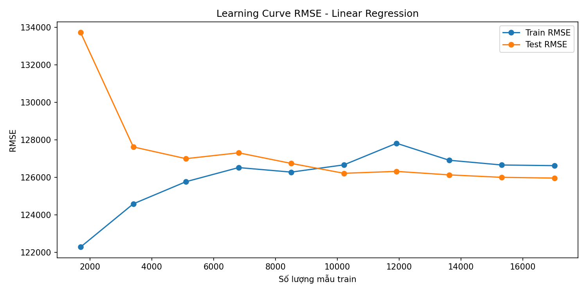
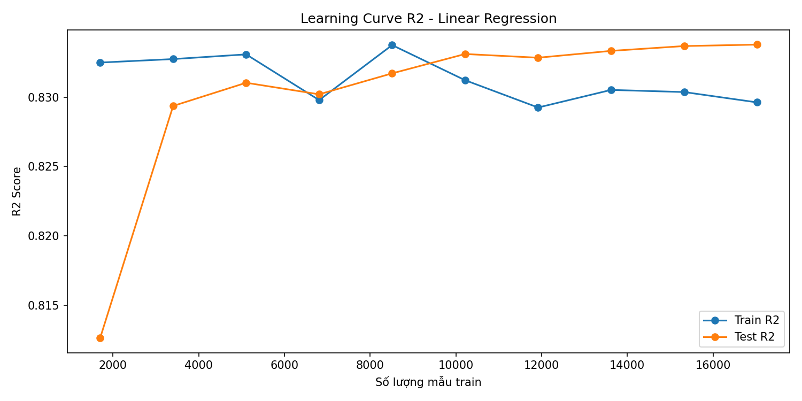
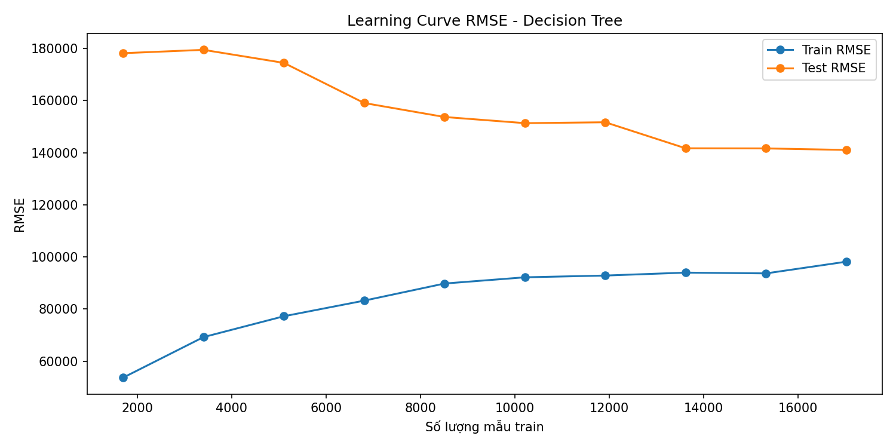
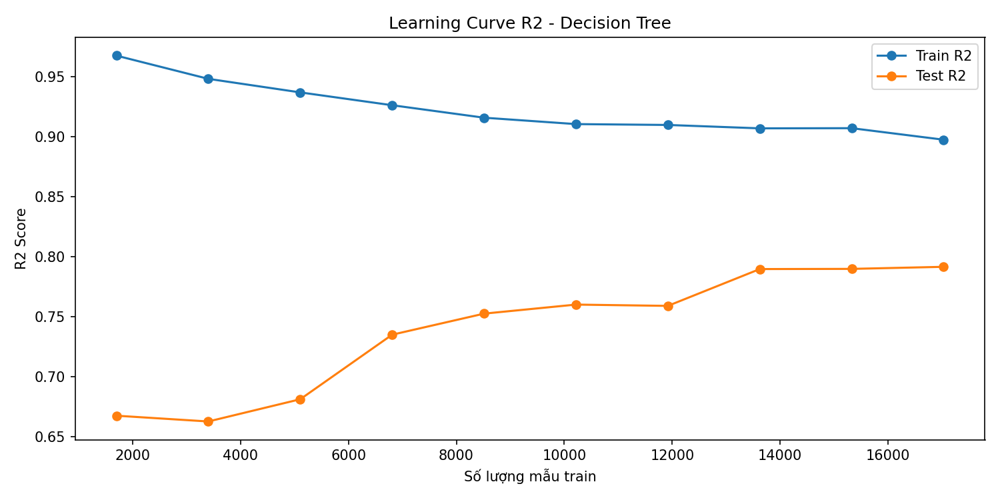
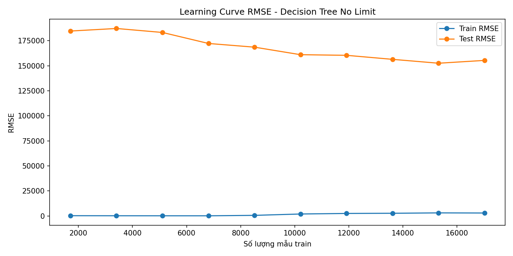
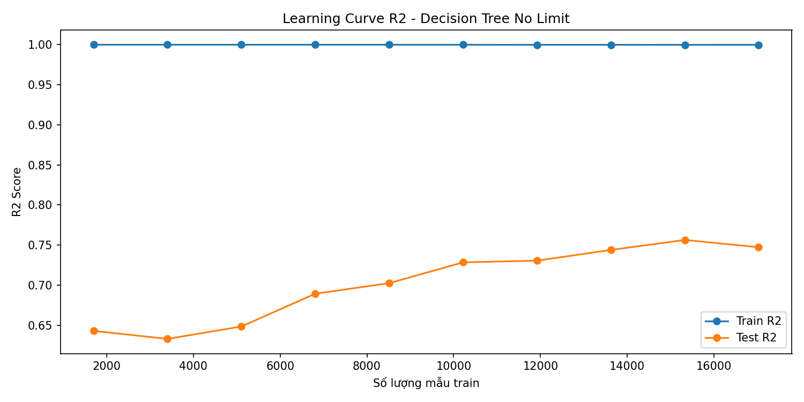
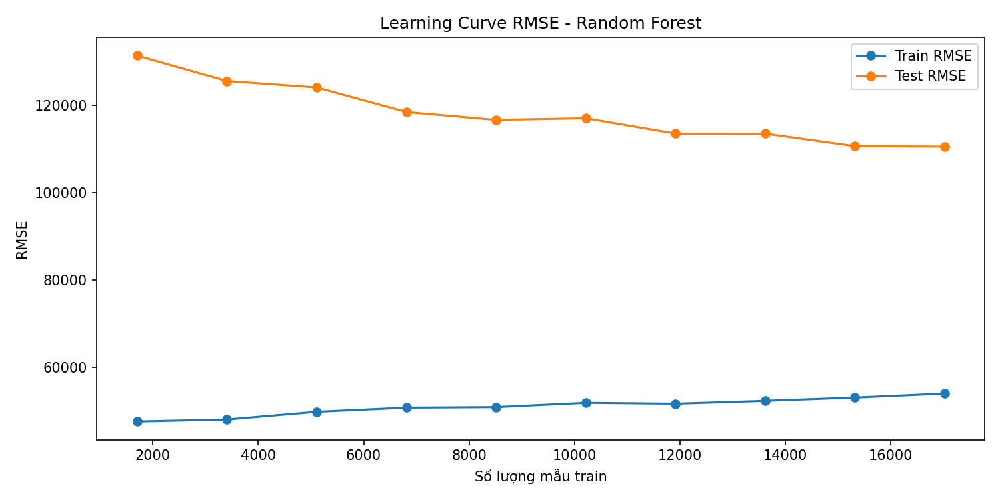
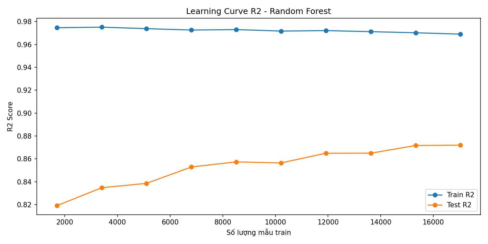
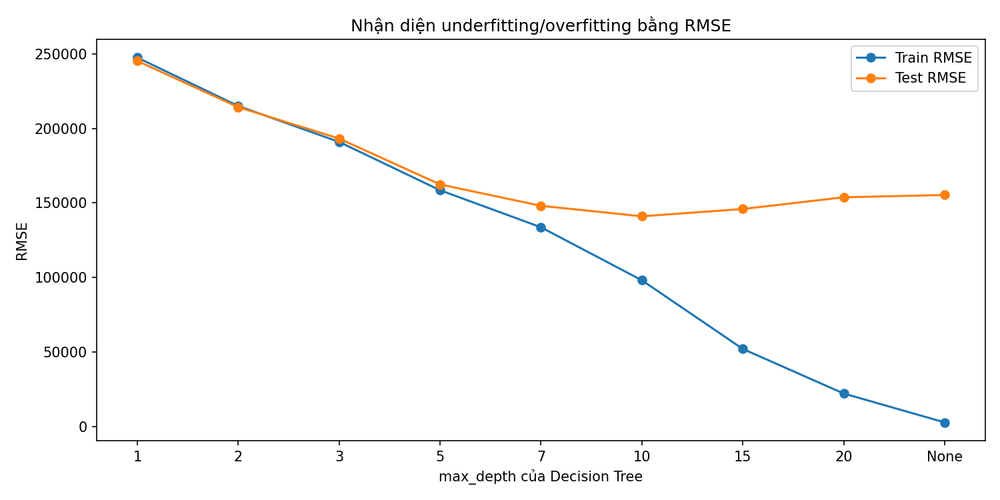
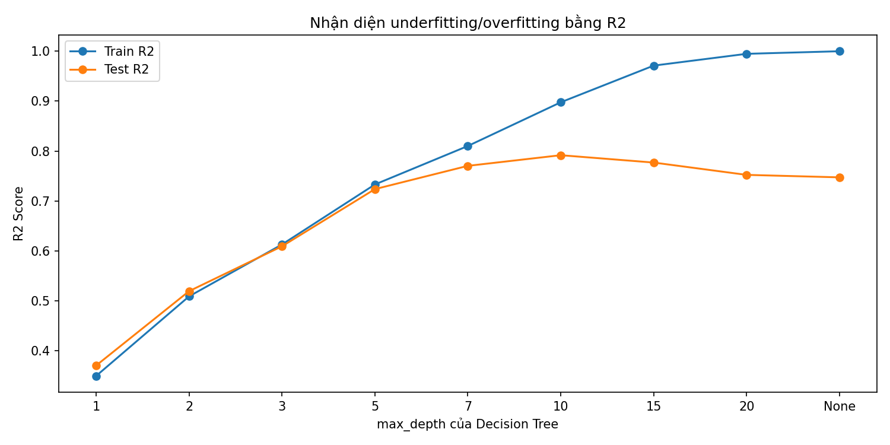

# Nhận xét kết quả cuối bài

## 1. Tổng quan kết quả

Sau khi làm sạch dữ liệu, xử lý các giá trị bất hợp lý và lọc bớt outlier về giá nhà, các mô hình được huấn luyện và đánh giá trên cùng tập train/test.

Bảng kết quả chính:

| Mô hình | Train MAE | Test MAE | Train RMSE | Test RMSE | Train R2 | Test R2 |
|---|---:|---:|---:|---:|---:|---:|
| Random Forest | 36,321.97 | 64,975.06 | 53,992.58 | 110,567.05 | 0.9690 | 0.8719 |
| Linear Regression | 83,774.94 | 83,094.68 | 126,622.87 | 125,958.68 | 0.8296 | 0.8338 |
| Decision Tree | 64,405.66 | 84,616.65 | 98,152.75 | 141,035.95 | 0.8976 | 0.7916 |
| Decision Tree No Limit | 116.11 | 93,348.29 | 2,890.86 | 155,324.62 | 0.9999 | 0.7472 |

Nhìn chung, các mô hình đều có `Test R2` dương sau khi xử lý outlier. Điều này cho thấy mô hình đã học được quan hệ có ý nghĩa giữa các đặc trưng đầu vào và giá nhà.

---

## 2. Mô hình tốt nhất

Mô hình cho kết quả tốt nhất là **Random Forest**.

Các chỉ số quan trọng:

- `Test MAE = 64,975.06`
- `Test RMSE = 110,567.05`
- `Test R2 = 0.8719`

Diễn giải:

- Trung bình, Random Forest dự đoán lệch khoảng **64,975 USD** so với giá thực tế.
- RMSE khoảng **110,567 USD**, cao hơn MAE vì vẫn còn một số căn nhà có sai số dự đoán lớn.
- `Test R2 = 0.8719` nghĩa là mô hình giải thích được khoảng **87.19% sự biến thiên của giá nhà** trên tập test.

Đây là kết quả tốt nhất trong bốn mô hình được thử nghiệm, xét theo cả `Test MAE`, `Test RMSE` và `Test R2`.

---

## 3. So sánh các mô hình

### Linear Regression

Linear Regression có kết quả khá tốt:

- `Train R2 = 0.8296`
- `Test R2 = 0.8338`
- `Test RMSE = 125,958.68`

Điểm đáng chú ý là `Train R2` và `Test R2` rất gần nhau. Điều này cho thấy mô hình **không bị overfitting rõ rệt**. Tuy nhiên, do Linear Regression giả định quan hệ tuyến tính, mô hình có thể chưa mô tả tốt các quan hệ phi tuyến giữa vị trí, chất lượng nhà, diện tích và giá nhà.

Linear Regression phù hợp để làm mô hình nền tảng vì đơn giản, dễ giải thích và có kết quả ổn định.

### Decision Tree

Decision Tree có giới hạn `max_depth=10` đạt:

- `Train R2 = 0.8976`
- `Test R2 = 0.7916`
- `Test RMSE = 141,035.95`

Mô hình học tốt trên tập train hơn Linear Regression, nhưng kết quả trên tập test lại thấp hơn. Khoảng cách giữa train và test cho thấy mô hình bắt đầu có dấu hiệu **overfitting**.

Decision Tree có khả năng học quan hệ phi tuyến, nhưng nếu không kiểm soát độ sâu, mô hình rất dễ học quá sát dữ liệu train.

### Decision Tree No Limit

Decision Tree không giới hạn độ sâu là ví dụ rõ nhất về overfitting:

- `Train R2 = 0.9999`
- `Test R2 = 0.7472`
- `Train RMSE = 2,890.86`
- `Test RMSE = 155,324.62`

Mô hình gần như ghi nhớ tập train, thể hiện qua `Train R2` gần bằng 1 và `Train RMSE` rất thấp. Tuy nhiên, khi dự đoán trên tập test, sai số tăng mạnh. Đây là minh chứng tốt để sinh viên thấy rằng **mô hình có kết quả rất cao trên tập train chưa chắc là mô hình tốt**.

### Random Forest

Random Forest đạt kết quả tốt nhất:

- `Train R2 = 0.9690`
- `Test R2 = 0.8719`
- `Test RMSE = 110,567.05`

Mô hình vẫn có khoảng cách giữa train và test, nghĩa là vẫn có một mức overfitting nhất định, nhưng ít nghiêm trọng hơn Decision Tree không giới hạn. Nhờ kết hợp nhiều cây quyết định, Random Forest tổng quát hóa tốt hơn và cho kết quả test tốt nhất.

---

## 4. Nhận xét về overfitting và underfitting

Không có mô hình nào bị underfitting nghiêm trọng vì các giá trị `Test R2` đều tương đối cao.

Mức độ overfitting có thể nhận xét như sau:

| Mô hình | Nhận xét |
|---|---|
| Linear Regression | Ổn định, ít overfitting, nhưng khả năng biểu diễn còn hạn chế |
| Decision Tree | Có dấu hiệu overfitting |
| Decision Tree No Limit | Overfitting rất rõ |
| Random Forest | Tốt nhất, vẫn hơi overfitting nhưng chấp nhận được |

Kết luận quan trọng cho sinh viên:

> Không nên chọn mô hình chỉ dựa vào kết quả trên tập train. Cần so sánh cả train và test để đánh giá khả năng tổng quát hóa.

---

## 5. Nhận xét từ learning curve

Learning curve được vẽ bằng cách tăng dần số lượng mẫu train từ 10% đến 100%, sau đó quan sát sự thay đổi của RMSE và R2 trên train/test.

### Linear Regression

Khi tăng dữ liệu train từ 10% lên 100%, kết quả test của Linear Regression thay đổi như sau:

| Tỉ lệ train | Test RMSE | Test R2 |
|---:|---:|---:|
| 10% | 133,726.99 | 0.8126 |
| 50% | 126,740.93 | 0.8317 |
| 100% | 125,958.68 | 0.8338 |

Nhận xét:

- Test R2 tăng nhẹ khi có thêm dữ liệu, từ 0.8126 lên 0.8338.
- Train và test khá gần nhau, cho thấy Linear Regression ít bị overfitting.
- Tuy nhiên, khi dữ liệu tăng thêm, kết quả chỉ cải thiện chậm. Điều này cho thấy mô hình có thể đã chạm giới hạn do giả định tuyến tính.

### Decision Tree với `max_depth=10`

| Tỉ lệ train | Train RMSE | Test RMSE | Train R2 | Test R2 |
|---:|---:|---:|---:|---:|
| 10% | 53,653.74 | 178,167.97 | 0.9677 | 0.6674 |
| 50% | 89,772.70 | 153,681.27 | 0.9160 | 0.7526 |
| 100% | 98,152.75 | 141,035.95 | 0.8976 | 0.7916 |

Nhận xét:

- Khi tăng dữ liệu, Test RMSE giảm từ 178,167.97 xuống 141,035.95.
- Test R2 tăng từ 0.6674 lên 0.7916, cho thấy mô hình hưởng lợi rõ từ việc có thêm dữ liệu.
- Tuy nhiên, train vẫn tốt hơn test khá nhiều, nên Decision Tree vẫn có dấu hiệu overfitting.

### Decision Tree không giới hạn độ sâu

| Tỉ lệ train | Train RMSE | Test RMSE | Train R2 | Test R2 |
|---:|---:|---:|---:|---:|
| 10% | 214.25 | 184,656.28 | 1.0000 | 0.6428 |
| 50% | 545.73 | 168,546.57 | 1.0000 | 0.7024 |
| 100% | 2,890.86 | 155,324.62 | 0.9999 | 0.7472 |

Nhận xét:

- Train RMSE gần như bằng 0 và Train R2 gần bằng 1 ở mọi kích thước dữ liệu.
- Test RMSE vẫn cao và Test R2 thấp hơn nhiều so với train.
- Đây là biểu hiện overfitting rất rõ: mô hình gần như ghi nhớ dữ liệu train nhưng tổng quát hóa kém hơn trên dữ liệu mới.

### Random Forest

| Tỉ lệ train | Train RMSE | Test RMSE | Train R2 | Test R2 |
|---:|---:|---:|---:|---:|
| 10% | 47,594.01 | 131,424.48 | 0.9746 | 0.8190 |
| 50% | 50,886.38 | 116,688.93 | 0.9730 | 0.8573 |
| 100% | 53,992.58 | 110,567.05 | 0.9690 | 0.8719 |

Nhận xét:

- Random Forest có Test RMSE giảm đều khi tăng dữ liệu train.
- Test R2 tăng từ 0.8190 lên 0.8719, cho thấy mô hình tận dụng thêm dữ liệu tốt.
- Mô hình vẫn có khoảng cách giữa train và test, nhưng khả năng tổng quát hóa tốt hơn Decision Tree đơn lẻ.

### Đường cong theo độ phức tạp của Decision Tree

Khi thay đổi `max_depth`, kết quả cho thấy:

| max_depth | Train RMSE | Test RMSE | Train R2 | Test R2 |
|---:|---:|---:|---:|---:|
| 1 | 247,437.11 | 245,173.71 | 0.3494 | 0.3703 |
| 3 | 190,896.68 | 193,159.98 | 0.6128 | 0.6091 |
| 7 | 133,699.58 | 148,076.85 | 0.8100 | 0.7703 |
| 10 | 98,152.75 | 141,035.95 | 0.8976 | 0.7916 |
| 15 | 52,134.29 | 145,932.74 | 0.9711 | 0.7769 |
| 20 | 22,239.41 | 153,789.56 | 0.9947 | 0.7522 |

Nhận xét:

- `max_depth=1` đến `max_depth=3`: mô hình quá đơn giản, train và test đều chưa tốt. Đây là vùng underfitting.
- `max_depth=7` đến `max_depth=10`: mô hình cân bằng hơn, Test R2 tốt nhất đạt 0.7916 tại `max_depth=10`.
- `max_depth=15`, `20` hoặc `None`: train tiếp tục tốt lên nhưng test xấu đi. Đây là vùng overfitting.

---

## 6. Phân tích đặc trưng quan trọng

Theo Random Forest, các đặc trưng quan trọng nhất gồm:

| Đặc trưng | Importance |
|---|---:|
| `grade` | 0.3810 |
| `lat` | 0.2052 |
| `sqft_living` | 0.1754 |
| `long` | 0.0598 |
| `sqft_living15` | 0.0300 |
| `house_age` | 0.0183 |
| `sqft_above` | 0.0172 |
| `view` | 0.0157 |
| `yr_built` | 0.0147 |
| `sqft_lot` | 0.0139 |

Nhận xét:

- `grade` là đặc trưng quan trọng nhất, cho thấy chất lượng tổng thể của căn nhà ảnh hưởng mạnh đến giá.
- `lat` và `long` có mức quan trọng cao, chứng tỏ vị trí địa lý là yếu tố then chốt trong bài toán giá nhà.
- `sqft_living` cũng rất quan trọng, phù hợp với trực giác rằng diện tích sử dụng càng lớn thì giá nhà thường càng cao.
- Các biến như `view`, `waterfront`, `zipcode` cũng có ý nghĩa vì phản ánh yếu tố vị trí, cảnh quan và khu vực.

Cần lưu ý rằng feature importance cho biết mức độ đóng góp của đặc trưng trong mô hình, nhưng không khẳng định quan hệ nhân quả tuyệt đối.

---

## 7. Nhận xét về một số dự đoán mẫu

Với 10 mẫu đầu tiên trong tập test, Random Forest có nhiều dự đoán khá gần giá thực tế. Một số ví dụ:

| Giá thực tế | Giá dự đoán | Sai số tuyệt đối |
|---:|---:|---:|
| 415,000 | 377,847.61 | 37,152.39 |
| 575,000 | 586,480.03 | 11,480.03 |
| 472,500 | 484,994.56 | 12,494.56 |
| 789,800 | 920,989.78 | 131,189.78 |
| 220,000 | 342,626.40 | 122,626.40 |

Nhận xét:

- Một số căn nhà được dự đoán rất sát, sai số chỉ khoảng 10,000 đến 40,000 USD.
- Một số căn có sai số trên 100,000 USD, cho thấy giá nhà còn phụ thuộc vào các yếu tố mà dữ liệu có thể chưa mô tả đầy đủ.
- RMSE lớn hơn MAE khá nhiều, chứng tỏ vẫn tồn tại các mẫu có sai số lớn.

---

## 8. Kết luận cuối bài

Trong bài thực hành này, mô hình **Random Forest** là lựa chọn tốt nhất cho bài toán dự đoán giá nhà vì có `Test RMSE` thấp nhất và `Test R2` cao nhất.

Kết quả cho thấy:

- Linear Regression là mô hình nền tảng tốt, ổn định và ít overfitting.
- Decision Tree dễ bị overfitting nếu không giới hạn độ sâu.
- Decision Tree không giới hạn độ sâu gần như ghi nhớ dữ liệu train và tổng quát hóa kém hơn.
- Random Forest cải thiện kết quả bằng cách kết hợp nhiều cây quyết định, giúp giảm sai số và tăng khả năng tổng quát hóa.
- Learning curve cho thấy Random Forest vẫn cải thiện khi tăng dữ liệu train, trong khi Linear Regression ổn định nhưng có giới hạn do giả định tuyến tính.

Về mặt thực tế, mô hình có thể hỗ trợ ước lượng giá nhà ban đầu, nhưng chưa nên dùng như công cụ định giá duy nhất. Để triển khai thực tế, cần bổ sung thêm dữ liệu về tình trạng nội thất, pháp lý, khoảng cách đến tiện ích, tình hình thị trường theo thời gian và kiểm tra kỹ các outlier trong dữ liệu.
