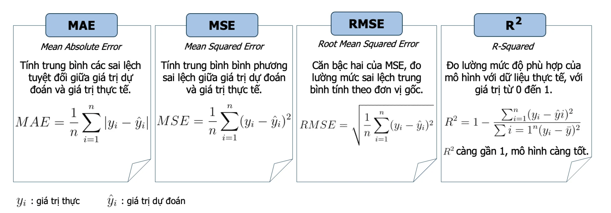

# Lab 06 - Đánh giá mô hình Regression

## Chủ đề: Dự đoán giá nhà

### 1. Mục tiêu bài thực hành

Sau bài thực hành này, sinh viên có thể:

- Hiểu bài toán hồi quy và cách áp dụng vào dự đoán giá nhà.
- Đọc, làm sạch và tiền xử lý dữ liệu dạng bảng.
- Tách dữ liệu thành tập huấn luyện và tập kiểm tra.
- Huấn luyện các mô hình hồi quy:
  - `LinearRegression`
  - `DecisionTreeRegressor`
  - `RandomForestRegressor`
- Đánh giá mô hình bằng các chỉ số MAE, MSE, RMSE và R2 Score.
- So sánh mô hình và nhận xét hiện tượng underfitting/overfitting.

---

## 2. Cấu trúc thư mục

```text
Lab06/
├── README.md
├── NHAN_XET_KET_QUA.md
├── requirements.txt
├── main.py
├── data/
│   └── house_pricing.csv
├── outputs/
│   └── ...
└── src/
    ├── __init__.py
    └── regression.py
```

Ý nghĩa các file:

- `README.md`: tài liệu hướng dẫn bài thực hành.
- `NHAN_XET_KET_QUA.md`: nhận xét mẫu dựa trên kết quả chạy thực tế.
- `requirements.txt`: danh sách thư viện cần cài đặt.
- `main.py`: file chạy chính của chương trình.
- `data/house_pricing.csv`: dữ liệu giá nhà.
- `outputs/`: thư mục chứa bảng kết quả và các biểu đồ sau khi chạy chương trình.
- `src/regression.py`: mã nguồn xử lý dữ liệu, huấn luyện, đánh giá và lưu kết quả.

---

## 3. Cài đặt môi trường

Tạo môi trường ảo, nếu cần:

```bash
python3 -m venv .venv
source .venv/bin/activate
```

Cài đặt thư viện:

```bash
pip install -r requirements.txt
```

Chạy bài thực hành:

```bash
python main.py
```

Sau khi chạy, chương trình sẽ:

- Đọc dữ liệu từ `data/house_pricing.csv`.
- Làm sạch dữ liệu.
- Huấn luyện các mô hình hồi quy.
- In bảng so sánh kết quả ra màn hình.
- Lưu kết quả vào thư mục `outputs/`.

Sau khi có kết quả, có thể đọc file `NHAN_XET_KET_QUA.md` để xem phần nhận xét mẫu cuối bài.

Các file kết quả quan trọng:

- `outputs/model_results.csv`: bảng chỉ số đánh giá các mô hình.
- `outputs/model_comparison_rmse.png`: biểu đồ so sánh RMSE.
- `outputs/model_comparison_r2.png`: biểu đồ so sánh R2.
- `outputs/learning_curves_all_models.csv`: bảng learning curve của tất cả mô hình.
- `outputs/learning_curve_linear_regression_rmse.png`: learning curve RMSE của Linear Regression.
- `outputs/learning_curve_linear_regression_r2.png`: learning curve R2 của Linear Regression.
- `outputs/learning_curve_decision_tree_rmse.png`: learning curve RMSE của Decision Tree.
- `outputs/learning_curve_decision_tree_r2.png`: learning curve R2 của Decision Tree.
- `outputs/learning_curve_decision_tree_no_limit_rmse.png`: learning curve RMSE của Decision Tree không giới hạn.
- `outputs/learning_curve_decision_tree_no_limit_r2.png`: learning curve R2 của Decision Tree không giới hạn.
- `outputs/learning_curve_random_forest_rmse.png`: learning curve RMSE của Random Forest.
- `outputs/learning_curve_random_forest_r2.png`: learning curve R2 của Random Forest.
- `outputs/overfit_underfit_decision_tree.csv`: bảng kết quả khi thay đổi `max_depth`.
- `outputs/overfit_underfit_decision_tree_rmse.png`: biểu đồ train/test RMSE theo độ sâu cây.
- `outputs/overfit_underfit_decision_tree_r2.png`: biểu đồ train/test R2 theo độ sâu cây.

---

## 4. Giới thiệu bài toán

Trong bài thực hành này, ta xây dựng mô hình dự đoán giá nhà dựa trên các đặc trưng như:

- Diện tích nhà: `sqft_living`, `sqft_lot`
- Số phòng ngủ: `bedrooms`
- Số phòng tắm: `bathrooms`
- Số tầng: `floors`
- Tình trạng và chất lượng nhà: `condition`, `grade`
- Năm xây dựng: `yr_built`
- Vị trí địa lý: `zipcode`, `lat`, `long`

Biến mục tiêu cần dự đoán là:

```python
price
```

Đây là bài toán regression vì giá nhà là một giá trị liên tục.

---

## 5. Giải thích các mô hình

### 5.1. LinearRegression

`LinearRegression` giả định rằng giá nhà có quan hệ tuyến tính với các biến đầu vào.

Ví dụ trực quan:

```text
price = w1 * sqft_living + w2 * bedrooms + w3 * bathrooms + ... + b
```

Trong đó:

- `price` là giá nhà cần dự đoán.
- `sqft_living`, `bedrooms`, `bathrooms`, ... là các đặc trưng đầu vào.
- `w1`, `w2`, `w3`, ... là trọng số mà mô hình học được từ dữ liệu.
- `b` là hệ số chặn.

Cách mô hình học:

- Mô hình tìm các trọng số sao cho sai lệch giữa giá dự đoán và giá thực tế là nhỏ nhất.
- Nếu một đặc trưng có trọng số dương, khi đặc trưng đó tăng thì giá dự đoán có xu hướng tăng.
- Nếu một đặc trưng có trọng số âm, khi đặc trưng đó tăng thì giá dự đoán có xu hướng giảm.

Ví dụ:

- Nếu `sqft_living` tăng, giá nhà thường tăng.
- Nếu nhà nằm ở khu vực có vị trí tốt, giá nhà cũng có thể tăng.

Ưu điểm:

- Đơn giản, dễ hiểu và dễ giải thích.
- Chạy nhanh.
- Phù hợp làm mô hình nền tảng để so sánh.

Hạn chế:

- Khó mô tả các quan hệ phi tuyến phức tạp.
- Dễ bị ảnh hưởng bởi ngoại lệ.

Dấu hiệu thường gặp:

- Nếu cả train và test đều có R2 thấp, Linear Regression có thể đang underfitting.
- Nếu train và test gần nhau nhưng kết quả chưa cao, mô hình có thể quá đơn giản so với dữ liệu.
- Linear Regression thường ít overfitting hơn Decision Tree, nhưng cũng kém linh hoạt hơn.

### 5.2. DecisionTreeRegressor

`DecisionTreeRegressor` dự đoán bằng cách chia dữ liệu thành nhiều nhánh dựa trên các điều kiện.

Ví dụ trực quan:

```text
Nếu sqft_living > 2000:
    Nếu grade >= 8:
        dự đoán giá nhà cao
    Ngược lại:
        dự đoán giá nhà trung bình
Ngược lại:
    dự đoán giá nhà thấp hơn
```

Cách mô hình học:

- Mô hình tự tìm các điều kiện chia dữ liệu sao cho các căn nhà trong cùng một nhóm có giá gần nhau nhất.
- Mỗi nút trong cây là một câu hỏi, ví dụ `grade <= 8.5` hoặc `sqft_living <= 2000`.
- Mỗi lá của cây chứa giá trị dự đoán, thường là trung bình giá nhà của các mẫu rơi vào lá đó.

Các tham số cơ bản:

- `max_depth`: độ sâu tối đa của cây.
- `min_samples_split`: số mẫu tối thiểu để tiếp tục chia một nút.
- `min_samples_leaf`: số mẫu tối thiểu ở một lá.

Ý nghĩa của `max_depth`:

- `max_depth` nhỏ: cây đơn giản, dễ underfitting.
- `max_depth` lớn: cây phức tạp, dễ overfitting.
- `max_depth=None`: cây có thể phát triển rất sâu và dễ ghi nhớ dữ liệu train.

Ưu điểm:

- Mô hình hóa được quan hệ phi tuyến.
- Dễ hiểu về mặt trực quan.
- Không bắt buộc phải chuẩn hóa dữ liệu số.

Hạn chế:

- Dễ overfitting nếu cây quá sâu.
- Kết quả có thể thay đổi mạnh khi dữ liệu thay đổi nhỏ.

Dấu hiệu thường gặp:

- Train R2 rất cao nhưng Test R2 thấp hơn nhiều: cây đang overfitting.
- Train và test đều thấp khi `max_depth` nhỏ: cây đang underfitting.
- Cần điều chỉnh `max_depth`, `min_samples_leaf` để mô hình tổng quát hóa tốt hơn.

### 5.3. RandomForestRegressor

`RandomForestRegressor` kết hợp nhiều cây quyết định. Mỗi cây học trên một phần dữ liệu và một phần đặc trưng khác nhau, sau đó lấy trung bình các kết quả dự đoán.

Cách mô hình học:

- Mô hình tạo nhiều Decision Tree khác nhau.
- Mỗi cây được huấn luyện trên một mẫu dữ liệu ngẫu nhiên.
- Khi chia nhánh, mỗi cây chỉ xem xét một nhóm đặc trưng ngẫu nhiên.
- Kết quả cuối cùng là trung bình dự đoán của tất cả các cây.

Trực giác:

- Một Decision Tree đơn lẻ có thể học quá sát dữ liệu.
- Nhiều cây khác nhau khi kết hợp lại sẽ giúp dự đoán ổn định hơn.
- Random Forest giảm rủi ro phụ thuộc vào một cây duy nhất.

Các tham số cơ bản:

- `n_estimators`: số lượng cây trong rừng.
- `max_depth`: độ sâu tối đa của mỗi cây.
- `min_samples_leaf`: số mẫu tối thiểu ở một lá.
- `random_state`: giúp kết quả có thể lặp lại.

Ưu điểm:

- Thường cho kết quả tốt hơn một cây quyết định đơn lẻ.
- Giảm overfitting so với Decision Tree.
- Có thể đánh giá mức độ quan trọng của các đặc trưng.

Hạn chế:

- Chạy chậm hơn Linear Regression và Decision Tree.
- Khó giải thích hơn một cây đơn lẻ.

Dấu hiệu thường gặp:

- Train R2 cao và Test R2 cũng cao: mô hình học tốt và tổng quát hóa tốt.
- Train R2 cao hơn Test R2 khá nhiều: vẫn có overfitting, cần giảm `max_depth` hoặc tăng `min_samples_leaf`.
- Nếu tăng dữ liệu train mà Test R2 vẫn cải thiện, mô hình còn có thể tốt hơn khi có thêm dữ liệu.

### 5.4. So sánh nhanh ba mô hình

| Tiêu chí | Linear Regression | Decision Tree | Random Forest |
|---|---|---|---|
| Độ phức tạp | Thấp | Trung bình đến cao | Cao |
| Khả năng học quan hệ phi tuyến | Hạn chế | Tốt | Tốt |
| Khả năng giải thích | Tốt | Khá tốt | Trung bình |
| Nguy cơ overfitting | Thấp | Cao nếu cây sâu | Trung bình |
| Tốc độ huấn luyện | Nhanh | Nhanh | Chậm hơn |
| Phù hợp làm mô hình nền | Rất phù hợp | Phù hợp để minh họa cây | Phù hợp để cải thiện hiệu năng |

---

## 6. Các chỉ số đánh giá regression


Giả sử:

- `y_true`: giá nhà thực tế.
- `y_pred`: giá nhà mô hình dự đoán.

### 6.1. MAE - Mean Absolute Error

MAE là trung bình sai số tuyệt đối.

```text
MAE = trung bình(|y_true - y_pred|)
```

Ý nghĩa:

- MAE càng nhỏ càng tốt.
- Cùng đơn vị với giá nhà, nên dễ giải thích.
- Ví dụ MAE = 85,000 nghĩa là trung bình mô hình dự đoán lệch khoảng 85,000 USD.

### 6.2. MSE - Mean Squared Error

MSE là trung bình bình phương sai số.

```text
MSE = trung bình((y_true - y_pred)^2)
```

Ý nghĩa:

- MSE càng nhỏ càng tốt.
- Phạt nặng các dự đoán sai lệch lớn.
- Đơn vị là bình phương của đơn vị giá nhà, nên khó diễn giải trực tiếp.

### 6.3. RMSE - Root Mean Squared Error

RMSE là căn bậc hai của MSE.

```text
RMSE = sqrt(MSE)
```

Ý nghĩa:

- RMSE càng nhỏ càng tốt.
- Cùng đơn vị với giá nhà.
- Nhạy cảm với các dự đoán sai lệch lớn hơn MAE.

### 6.4. R2 Score

R2 cho biết mô hình giải thích được bao nhiêu phần biến thiên của biến mục tiêu.

```text
R2 gần 1: mô hình tốt
R2 gần 0: mô hình không tốt hơn nhiều so với dự đoán bằng giá trị trung bình
R2 < 0: mô hình rất kém
```

---

## 7. Quy trình thực hành

### Bước 1. Đọc dữ liệu

Sinh viên đọc dữ liệu từ `data/house_pricing.csv` và quan sát kích thước, kiểu dữ liệu, vài dòng đầu tiên.

### Bước 2. Làm sạch dữ liệu

Trong bộ dữ liệu này có một số vấn đề cần xử lý:

- Cột `price` có thể chứa ký tự `$`.
- Một số dòng có `price` âm.
- Một số dòng có `bedrooms` âm.
- Một số dòng có giá nhà cực đoan, ví dụ rất lớn so với phần còn lại của dữ liệu.
- Cột `yr_renovated` có nhiều giá trị thiếu.
- Cột `date` cần chuyển sang kiểu thời gian để tạo thêm biến `sale_year`, `sale_month`.

Lưu ý:

- Trong dữ liệu có dòng giá nhà lên tới hàng trăm triệu USD, cao bất thường so với phân phối chung.
- Nếu dòng này rơi vào tập test, `Test R2` có thể âm rất lớn vì sai số tại một điểm outlier làm tổng sai số tăng mạnh.
- File code đã lọc bớt outlier theo khoảng phân vị 1% đến 99.5% của `price` để bài thực hành ổn định hơn.

### Bước 3. Chuẩn bị đặc trưng

Ta loại bỏ các cột không dùng trực tiếp:

- `id`: mã định danh.
- `date`: đã được tách thành năm bán và tháng bán.
- `price`: biến mục tiêu.

Với `zipcode`, ta xem đây là biến phân loại vì nó đại diện cho khu vực.

### Bước 4. Chia train/test

Tập dữ liệu được chia thành:

- 80% dùng để huấn luyện.
- 20% dùng để kiểm tra.

### Bước 5. Huấn luyện mô hình

Các mô hình/cấu hình được huấn luyện:

- Linear Regression
- Decision Tree với `max_depth=10`
- Decision Tree không giới hạn độ sâu
- Random Forest

### Bước 6. Đánh giá và so sánh

Mỗi mô hình được đánh giá trên cả tập train và tập test bằng:

- MAE
- MSE
- RMSE
- R2 Score

Khi nhận xét, cần chú ý:

- Nếu train tốt nhưng test kém: mô hình có dấu hiệu overfitting.
- Nếu cả train và test đều kém: mô hình có thể bị underfitting.
- Nếu test RMSE thấp và test R2 cao: mô hình có khả năng tổng quát hóa tốt hơn.

### Bước 7. Quan sát underfitting và overfitting bằng biểu đồ

Với tất cả mô hình, chương trình vẽ learning curve theo số lượng mẫu train.

Ý nghĩa khi đọc learning curve:

- Nếu train và test đều kém: mô hình có xu hướng underfitting.
- Nếu train rất tốt nhưng test kém hơn nhiều: mô hình có xu hướng overfitting.
- Nếu thêm dữ liệu giúp test tốt dần lên: mô hình còn có thể cải thiện khi có thêm dữ liệu.
- Nếu thêm dữ liệu nhưng train/test đều không cải thiện nhiều: nên thử đặc trưng mới hoặc mô hình khác.

Ngoài learning curve, chương trình có thêm validation curve cho Decision Tree bằng cách thay đổi `max_depth`.

Ý nghĩa khi đọc validation curve:

- `max_depth` nhỏ: mô hình quá đơn giản. Nếu cả train và test đều có RMSE cao hoặc R2 thấp, đó là dấu hiệu underfitting.
- `max_depth` vừa phải: train và test cùng tốt, khoảng cách giữa hai đường không quá lớn. Đây thường là vùng mô hình tổng quát hóa tốt.
- `max_depth` quá lớn hoặc `None`: train rất tốt nhưng test không cải thiện hoặc xấu đi. Đây là dấu hiệu overfitting.

---

## 8. Câu hỏi thảo luận

1. Vì sao không nên đánh giá mô hình chỉ trên tập train?
2. MAE và RMSE khác nhau như thế nào?
3. Khi nào RMSE lớn hơn MAE rất nhiều? Điều đó nói gì về mô hình?
4. Vì sao Decision Tree dễ bị overfitting?
5. Random Forest giảm overfitting bằng cách nào?
6. Mô hình nào có kết quả tốt nhất theo `Test RMSE`?
7. Mô hình nào dễ giải thích nhất? Vì sao?
8. Nếu muốn cải thiện kết quả, em sẽ thử những cách nào?

---

## 9. Bài tập cho sinh viên

### Bài 1. Thay đổi tỉ lệ train/test

Thử các tỉ lệ:

- 70% train, 30% test
- 80% train, 20% test
- 90% train, 10% test

Lập bảng so sánh `Test MAE`, `Test RMSE`, `Test R2`.

### Bài 2. Điều chỉnh Decision Tree

Thử các giá trị:

```python
max_depth = [3, 5, 10, 15, None]
```

Trả lời:

- Giá trị nào cho kết quả test tốt nhất?
- Trường hợp nào có dấu hiệu overfitting rõ nhất?

### Bài 3. Điều chỉnh Random Forest

Thử các giá trị:

```python
n_estimators = [50, 100, 200]
max_depth = [10, 15, 20, None]
```

Trả lời:

- Mô hình nào có `Test RMSE` nhỏ nhất?
- Tăng `n_estimators` có luôn làm mô hình tốt hơn không?

### Bài 4. Thêm biến mới

Tạo thêm các biến:

```python
df["house_age"] = df["sale_year"] - df["yr_built"]
df["is_renovated"] = (df["yr_renovated"] > 0).astype(int)
```

Huấn luyện lại các mô hình và so sánh kết quả với ban đầu.

### Bài 5. Viết nhận xét cuối bài

Sinh viên viết ngắn gọn:

- Mô hình nào tốt nhất?
- Dựa trên chỉ số nào?
- Có dấu hiệu overfitting không?
- Các đặc trưng nào ảnh hưởng mạnh đến giá nhà?
- Nếu triển khai vào thực tế, cần cảnh báo những hạn chế nào?

---

## 10. Tiêu chí chấm điểm gợi ý

| Tiêu chí | Điểm |
|---|---:|
| Đọc và mô tả dữ liệu | 1.0 |
| Làm sạch dữ liệu đúng | 1.5 |
| Tách train/test đúng | 1.0 |
| Huấn luyện Linear Regression | 1.0 |
| Huấn luyện Decision Tree | 1.0 |
| Huấn luyện Random Forest | 1.0 |
| Tính và giải thích MAE, RMSE, R2 | 1.5 |
| So sánh mô hình và nhận xét overfitting | 1.0 |
| Trình bày kết quả rõ ràng | 1.0 |
| Tổng | 10.0 |
