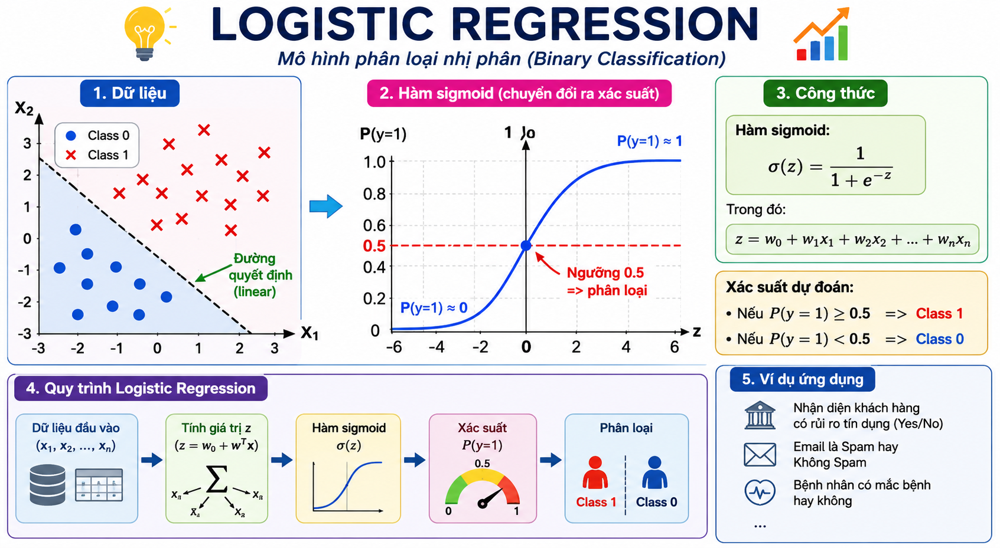
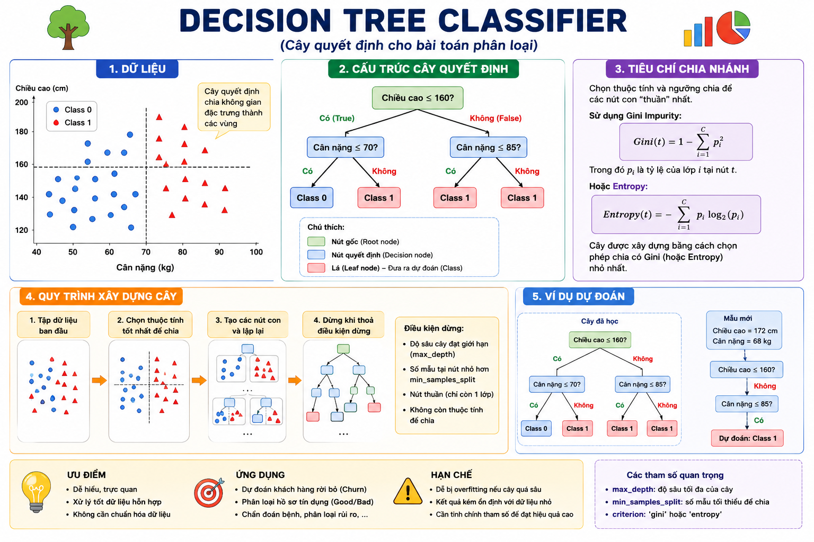
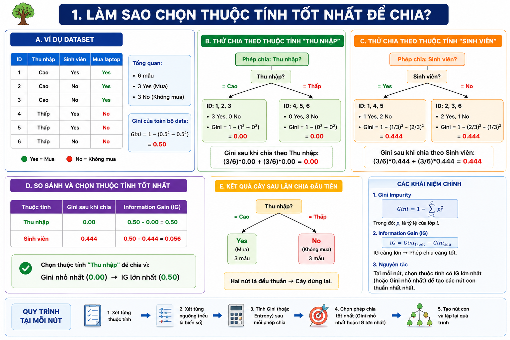
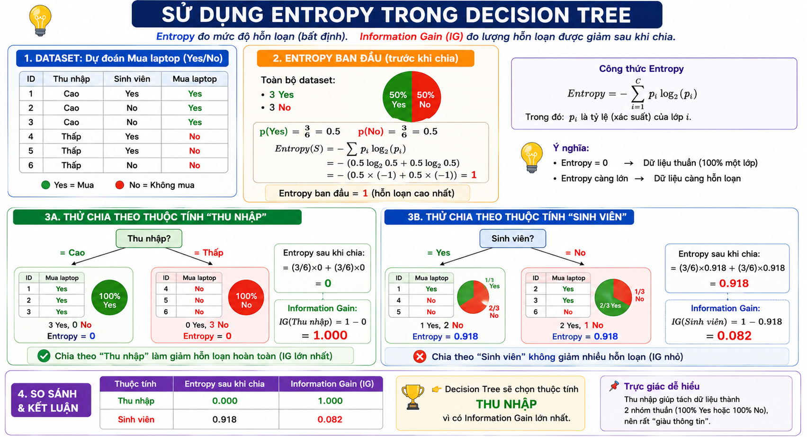
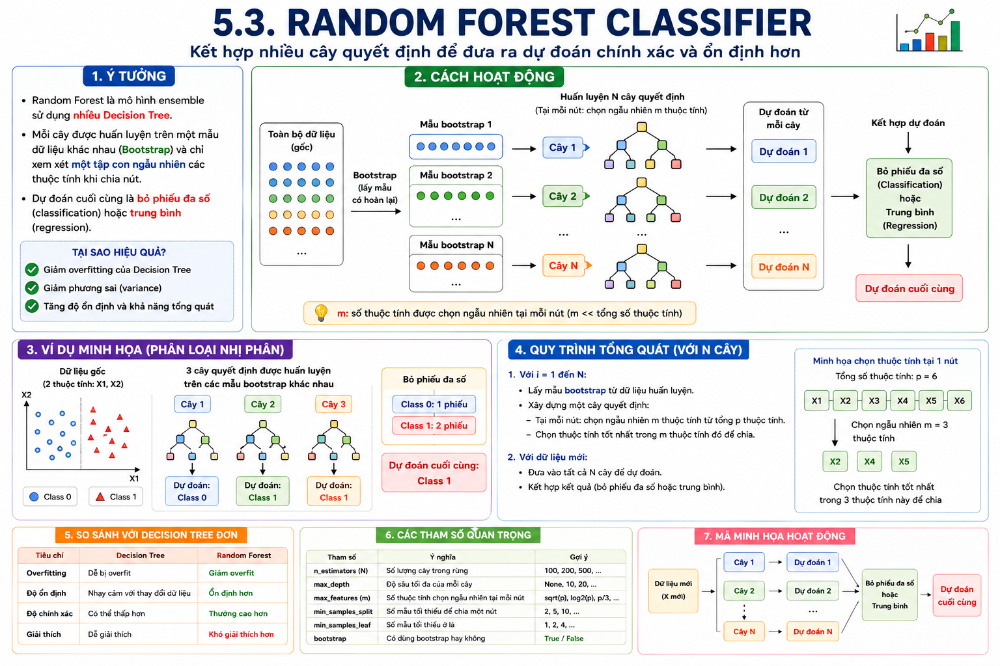
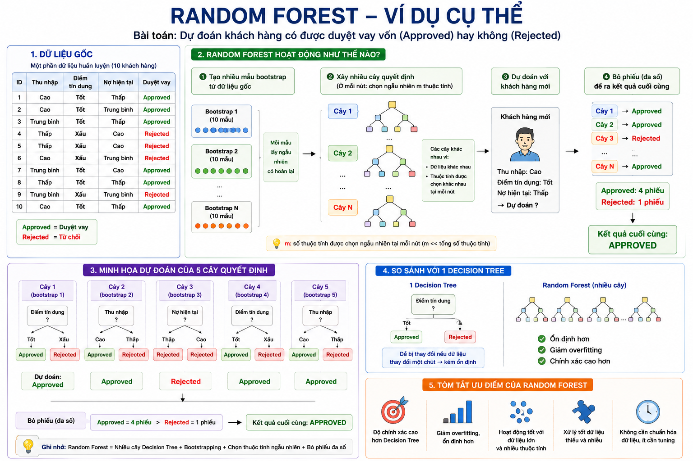

# Lab 07 - Đánh giá mô hình Classification

## Chủ đề: Loan Approval Prediction

### 1. Mục tiêu bài thực hành

Sau bài thực hành này, sinh viên có thể:

- Hiểu bài toán classification và ứng dụng trong dự đoán phê duyệt khoản vay.
- Đọc, làm sạch và tiền xử lý dữ liệu dạng bảng.
- Phân biệt biến đầu vào và biến mục tiêu.
- Huấn luyện các mô hình classification cơ bản:
  - `LogisticRegression`
  - `DecisionTreeClassifier`
  - `RandomForestClassifier`
- Đánh giá mô hình bằng Accuracy, Precision, Recall, F1-score, ROC-AUC và Confusion Matrix.
- Quan sát overfitting/underfitting bằng learning curve và validation curve.
- Viết nhận xét cuối bài dựa trên kết quả thực nghiệm.

---

## 2. Cấu trúc thư mục

```text
Lab07/
├── README.md
├── NHAN_XET_KET_QUA.md
├── requirements.txt
├── main.py
├── data/
│   ├── README.md
│   └── loan_approval_dataset.csv
├── outputs/
│   └── ...
└── src/
    ├── __init__.py
    └── classification.py
```

Ý nghĩa các file:

- `README.md`: tài liệu hướng dẫn bài thực hành.
- `NHAN_XET_KET_QUA.md`: mẫu nhận xét kết quả cuối bài.
- `requirements.txt`: danh sách thư viện cần cài đặt.
- `main.py`: file chạy chính.
- `data/loan_approval_dataset.csv`: dữ liệu Loan Approval Prediction.
- `src/classification.py`: mã nguồn xử lý dữ liệu, huấn luyện, đánh giá và vẽ biểu đồ.
- `outputs/`: thư mục chứa kết quả sau khi chạy.

---

## 3. Chuẩn bị môi trường

Tạo môi trường ảo, nếu cần:

```bash
python3 -m venv .venv
source .venv/bin/activate
```

Cài đặt thư viện:

```bash
pip install -r requirements.txt
```

Đặt dataset vào:

```text
data/loan_approval_dataset.csv
```

Chạy bài thực hành:

```bash
python main.py
```

Sau khi chạy, chương trình sẽ lưu kết quả vào `outputs/`.

Các file kết quả quan trọng:

- `outputs/model_results.csv`: bảng so sánh chỉ số các mô hình.
- `outputs/classification_reports.csv`: precision, recall, F1-score theo từng lớp.
- `outputs/roc_curves.png`: đường ROC của các mô hình.
- `outputs/confusion_matrix_*.png`: confusion matrix của từng mô hình.
- `outputs/model_comparison_test_f1.png`: so sánh F1-score.
- `outputs/model_comparison_test_roc_auc.png`: so sánh ROC-AUC.
- `outputs/learning_curves_all_models.csv`: learning curve của tất cả mô hình.
- `outputs/learning_curve_*_f1.png`: learning curve theo F1-score.
- `outputs/learning_curve_*_accuracy.png`: learning curve theo Accuracy.
- `outputs/validation_curve_decision_tree.csv`: validation curve theo `max_depth`.
- `outputs/validation_curve_decision_tree_f1.png`: validation curve F1 của Decision Tree.
- `outputs/validation_curve_decision_tree_accuracy.png`: validation curve Accuracy của Decision Tree.

---

## 4. Giới thiệu bài toán

Bài toán Loan Approval Prediction là bài toán dự đoán hồ sơ vay vốn có được phê duyệt hay không.

Biến mục tiêu:

```text
loan_status
```

Các lớp thường gặp:

- `Approved`: khoản vay được phê duyệt.
- `Rejected`: khoản vay bị từ chối.

Đây là bài toán **classification** vì mô hình cần dự đoán một nhãn rời rạc, không phải một giá trị liên tục.

Một số đặc trưng đầu vào thường có:

- `income_annum`: thu nhập hằng năm.
- `loan_amount`: số tiền vay.
- `loan_term`: thời hạn vay.
- `cibil_score`: điểm tín dụng.
- `education`: trình độ học vấn.
- `self_employed`: có tự kinh doanh hay không.
- `residential_assets_value`, `commercial_assets_value`, `luxury_assets_value`, `bank_asset_value`: giá trị tài sản.

---

## 5. Kiến thức nền về các mô hình

### 5.1. LogisticRegression

`LogisticRegression` là mô hình classification tuyến tính. Dù có chữ "Regression", mô hình này thường dùng cho phân loại nhị phân.



Ý tưởng chính:

- Mô hình tính một điểm số từ các đặc trưng đầu vào.
- Điểm số được chuyển thành xác suất bằng hàm sigmoid.
- Nếu xác suất lớn hơn một ngưỡng, thường là 0.5, mô hình dự đoán lớp `Approved`; ngược lại dự đoán `Rejected`.

Ví dụ trực quan:

```text
P(Approved) = sigmoid(w1 * income + w2 * cibil_score + w3 * loan_amount + ... + b)
```

Ưu điểm:

- Đơn giản, chạy nhanh.
- Dễ dùng làm mô hình nền tảng.
- Có thể diễn giải ảnh hưởng của đặc trưng thông qua hệ số.

Hạn chế:

- Giả định ranh giới phân lớp gần tuyến tính.
- Có thể chưa tốt nếu quan hệ giữa các biến quá phức tạp.

Dấu hiệu thường gặp:

- Train và test đều thấp: mô hình có thể underfitting.
- Train và test gần nhau nhưng chưa cao: mô hình ổn định nhưng chưa đủ linh hoạt.

### 5.2. DecisionTreeClassifier

`DecisionTreeClassifier` phân loại bằng cách đặt các câu hỏi dạng điều kiện.



Ví dụ:

```text
cibil_score >= 650?
├── Có:
│   ├── income_annum đủ cao?
│   │   ├── Có: Approved
│   │   └── Không: Rejected
└── Không:
    └── Rejected
```

Cách mô hình học:

- Cây tự tìm các điều kiện chia dữ liệu sao cho mỗi nhóm sau khi chia càng "thuần" về nhãn càng tốt.
- Mỗi nút là một câu hỏi.
- Mỗi lá là một dự đoán lớp.

Tham số quan trọng:

- `max_depth`: độ sâu tối đa của cây.
- `min_samples_split`: số mẫu tối thiểu để tiếp tục chia.
- `min_samples_leaf`: số mẫu tối thiểu ở một lá.

Ý nghĩa của `max_depth`:

- `max_depth` nhỏ: cây đơn giản, dễ underfitting.
- `max_depth` lớn: cây phức tạp, dễ overfitting.
- `max_depth=None`: cây không bị giới hạn độ sâu, rất dễ học thuộc dữ liệu train.

Ưu điểm:

- Dễ giải thích.
- Học được quan hệ phi tuyến.
- Không bắt buộc phải chuẩn hóa dữ liệu số.

Hạn chế:

- Dễ overfitting nếu cây quá sâu.
- Nhạy với thay đổi nhỏ trong dữ liệu.

Một số tiêu chí chia nhánh thường dùng:




Information Gain (IG) là độ giảm Entropy sau khi thực hiện một phép chia.

Công thức:

IG(S,A)=Entropy(S)−Entropy(S∣A)

Trong đó:

S: tập dữ liệu hiện tại
A: thuộc tính dùng để chia
Entropy(S): độ hỗn loạn trước khi chia
Entropy(S∣A): độ hỗn loạn sau khi chia

### 5.3. RandomForestClassifier

`RandomForestClassifier` là mô hình kết hợp nhiều Decision Tree.



Ý tưởng chính:

- Tạo nhiều cây quyết định khác nhau.
- Mỗi cây học trên một phần dữ liệu và một phần đặc trưng ngẫu nhiên.
- Khi dự đoán, các cây cùng bỏ phiếu.
- Lớp được nhiều cây chọn nhất là kết quả cuối cùng.

Ưu điểm:

- Thường chính xác hơn Decision Tree đơn lẻ.
- Giảm overfitting so với một cây đơn.
- Có thể đánh giá feature importance.

Hạn chế:

- Chạy chậm hơn Logistic Regression và Decision Tree.
- Khó giải thích hơn một cây đơn lẻ.

Ví dụ trực quan:



### 5.4. So sánh nhanh

| Tiêu chí | Logistic Regression | Decision Tree | Random Forest |
|---|---|---|---|
| Độ phức tạp | Thấp | Trung bình đến cao | Cao |
| Quan hệ phi tuyến | Hạn chế | Tốt | Tốt |
| Dễ giải thích | Tốt | Khá tốt | Trung bình |
| Nguy cơ overfitting | Thấp | Cao nếu cây sâu | Trung bình |
| Tốc độ huấn luyện | Nhanh | Nhanh | Chậm hơn |
| Vai trò trong bài lab | Mô hình nền | Minh họa overfit | Mô hình mạnh hơn |

---

## 6. Các chỉ số đánh giá classification

### 6.1. Confusion Matrix

Confusion Matrix cho biết mô hình phân loại đúng/sai như thế nào.

Với bài toán này:

- Positive: `Approved`
- Negative: `Rejected`

Các trường hợp:

- True Positive: thực tế Approved, mô hình dự đoán Approved.
- True Negative: thực tế Rejected, mô hình dự đoán Rejected.
- False Positive: thực tế Rejected, mô hình dự đoán Approved.
- False Negative: thực tế Approved, mô hình dự đoán Rejected.

Trong bối cảnh khoản vay:

- False Positive có thể nguy hiểm vì mô hình phê duyệt nhầm hồ sơ đáng lẽ bị từ chối.
- False Negative có thể làm mất khách hàng tốt vì mô hình từ chối nhầm hồ sơ đáng lẽ được phê duyệt.

### 6.2. Accuracy

Accuracy là tỉ lệ dự đoán đúng trên toàn bộ tập dữ liệu.

```text
Accuracy = số dự đoán đúng / tổng số mẫu
```

Accuracy dễ hiểu, nhưng có thể gây hiểu nhầm nếu dữ liệu mất cân bằng lớp.

### 6.3. Precision

Precision trả lời câu hỏi:

```text
Trong các hồ sơ mô hình dự đoán Approved, có bao nhiêu hồ sơ thật sự Approved?
```

Precision cao giúp giảm phê duyệt nhầm.

### 6.4. Recall

Recall trả lời câu hỏi:

```text
Trong các hồ sơ thật sự Approved, mô hình tìm đúng được bao nhiêu?
```

Recall cao giúp giảm bỏ sót hồ sơ tốt.

### 6.5. F1-score

F1-score là trung bình điều hòa giữa Precision và Recall.

```text
F1 = 2 * Precision * Recall / (Precision + Recall)
```

F1-score hữu ích khi cần cân bằng giữa Precision và Recall.

### 6.6. ROC-AUC

ROC-AUC đo khả năng phân biệt hai lớp của mô hình ở nhiều ngưỡng khác nhau.

Ý nghĩa:

- ROC-AUC gần 1: mô hình phân biệt tốt.
- ROC-AUC khoảng 0.5: mô hình gần như đoán ngẫu nhiên.

---

## 7. Quy trình thực hành

### Bước 1. Đọc dữ liệu

Sinh viên đọc dữ liệu từ `data/loan_approval_dataset.csv`, quan sát số dòng, số cột, kiểu dữ liệu và vài dòng đầu tiên.

### Bước 2. Làm sạch dữ liệu

Các bước chính:

- Chuẩn hóa tên cột.
- Loại dòng trùng lặp.
- Loại hoặc xử lý giá trị thiếu.
- Chuẩn hóa nhãn `Approved`/`Rejected`.
- Loại cột định danh như `loan_id`.

### Bước 3. Chuẩn bị đặc trưng

Ta tách:

- `X`: các đặc trưng đầu vào.
- `y`: nhãn cần dự đoán.

Các cột số được chuẩn hóa bằng `StandardScaler`.

Các cột phân loại được mã hóa bằng `OneHotEncoder`.

### Bước 4. Chia train/test

Dữ liệu được chia:

- 80% train.
- 20% test.

Sử dụng `stratify=y` để giữ tỉ lệ lớp Approved/Rejected tương tự nhau ở train và test.

### Bước 5. Huấn luyện mô hình

Các mô hình/cấu hình được huấn luyện:

- Logistic Regression.
- Decision Tree với `max_depth=5`.
- Decision Tree không giới hạn độ sâu.
- Random Forest.

### Bước 6. Đánh giá mô hình

Mỗi mô hình được đánh giá bằng:

- Accuracy.
- Precision.
- Recall.
- F1-score.
- ROC-AUC.
- Confusion Matrix.

Gợi ý đọc kết quả:

- Nếu Accuracy cao nhưng Recall thấp, mô hình có thể bỏ sót nhiều hồ sơ Approved.
- Nếu Precision thấp, mô hình có thể phê duyệt nhầm nhiều hồ sơ.
- Nếu Train score cao nhưng Test score thấp, mô hình có dấu hiệu overfitting.
- Nếu Train và Test đều thấp, mô hình có thể underfitting.

### Bước 7. Learning curve và validation curve

Learning curve:

- Trục x: số lượng mẫu train.
- Trục y: Train/Test Accuracy hoặc Train/Test F1.
- Dùng để xem mô hình có cải thiện khi tăng dữ liệu không.

Validation curve:

- Trục x: giá trị hyperparameter, ở đây là `max_depth` của Decision Tree.
- Trục y: Train/Test Accuracy hoặc Train/Test F1.
- Dùng để xem mô hình underfit/overfit khi độ phức tạp thay đổi.

---

## 8. Câu hỏi thảo luận

1. Vì sao Accuracy không phải lúc nào cũng đủ để đánh giá mô hình classification?
2. Precision và Recall khác nhau như thế nào?
3. Trong bài toán phê duyệt khoản vay, False Positive và False Negative có ý nghĩa gì?
4. Khi nào nên ưu tiên Precision?
5. Khi nào nên ưu tiên Recall?
6. Vì sao Decision Tree dễ bị overfitting?
7. Random Forest giảm overfitting bằng cách nào?
8. Learning curve giúp ta hiểu gì về mô hình?
9. Validation curve theo `max_depth` cho ta biết điều gì?
10. Mô hình nào nên chọn nếu cần cân bằng Precision và Recall?

---

## 9. Bài tập cho sinh viên

### Bài 1. So sánh mô hình

Chạy chương trình và lập bảng so sánh:

- Accuracy.
- Precision.
- Recall.
- F1-score.
- ROC-AUC.

Trả lời:

- Mô hình nào có F1-score tốt nhất?
- Mô hình nào có Recall tốt nhất?
- Mô hình nào có Precision tốt nhất?

### Bài 2. Phân tích confusion matrix

Với mô hình tốt nhất, hãy đọc confusion matrix và trả lời:

- Có bao nhiêu hồ sơ Approved bị dự đoán nhầm thành Rejected?
- Có bao nhiêu hồ sơ Rejected bị dự đoán nhầm thành Approved?
- Loại sai lầm nào nguy hiểm hơn trong thực tế?

### Bài 3. Điều chỉnh Decision Tree

Thử các giá trị:

```python
max_depth = [1, 2, 3, 5, 7, 10, 15, None]
```

Trả lời:

- Giá trị nào cho Test F1 tốt nhất?
- Khi nào cây bắt đầu overfitting?

### Bài 4. Thử thêm mô hình

Sinh viên có thể thử thêm một trong các mô hình:

- `KNeighborsClassifier`
- `SVC`
- `GradientBoostingClassifier`

So sánh kết quả với ba mô hình ban đầu.

### Bài 5. Viết nhận xét cuối bài

Sinh viên viết ngắn gọn:

- Mô hình nào tốt nhất?
- Chọn mô hình dựa trên chỉ số nào?
- Có dấu hiệu overfitting không?
- Precision/Recall nói gì về rủi ro phê duyệt khoản vay?
- Nếu triển khai thực tế, cần lưu ý điều gì?

---

## 10. Tiêu chí chấm điểm gợi ý

| Tiêu chí | Điểm |
|---|---:|
| Đọc và mô tả dữ liệu | 1.0 |
| Làm sạch và chuẩn hóa nhãn | 1.5 |
| Tách train/test đúng, có stratify | 1.0 |
| Huấn luyện Logistic Regression | 1.0 |
| Huấn luyện Decision Tree | 1.0 |
| Huấn luyện Random Forest | 1.0 |
| Tính và giải thích Accuracy, Precision, Recall, F1 | 1.5 |
| Phân tích confusion matrix và overfitting | 1.0 |
| Trình bày kết quả rõ ràng | 1.0 |
| Tổng | 10.0 |
